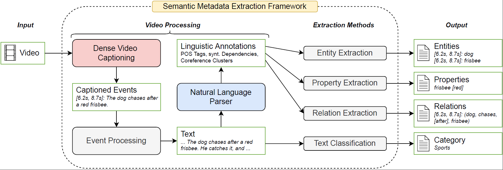
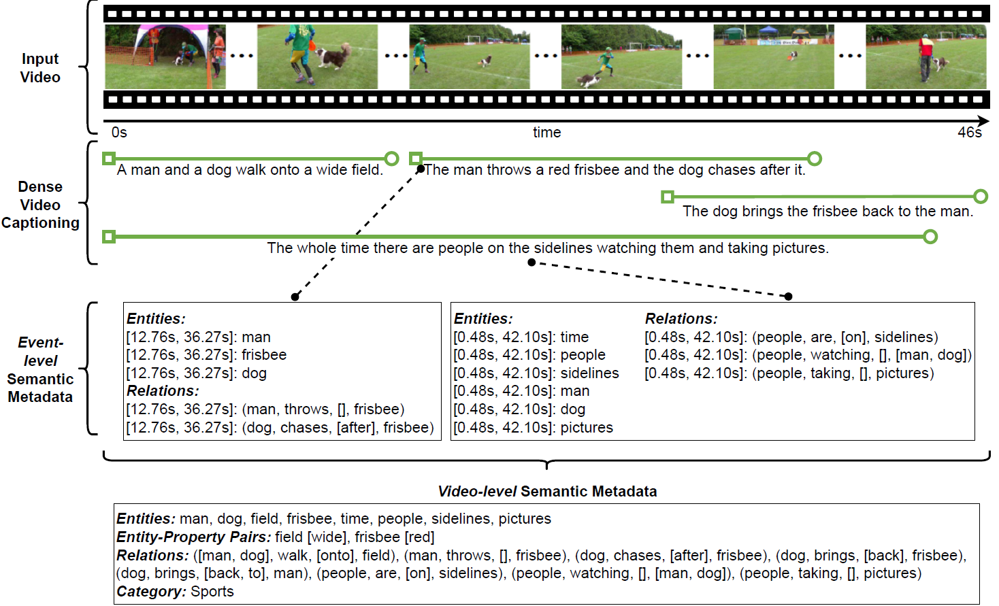

# Semantic Metadata Extraction from Generated Video Captions

This repository provides the implementation code of our entity, property & relation extraction methods which we 
introduced in our paper [Semantic Metadata Extraction from Generated Video Captions](https://arxiv.org/abs/2211.02982) (Johannes Scherer, Ansgar Scherp and Deepayan Bhowmik). We proposed a framework (which combines Video Captioning and NLP methods) to 
extract semantic metadata solely from automatically generated video captions. As metadata, we considered entities, 
the entities’ properties, relations between entities, and the video category.

<p align="center">
  
</p>

<p align="center">
  
</p>


## Table of Contents
You may test the extraction methods on custom text and captioned events (see [Usage](#usage)). This repository does **<ins>not</ins>** contain the implementation of our method for video classification using generated captioned video events, the scripts that we used to evaluate our extraction methods, nor the trained models of the Dense Video Captioning methods that we employed (see [References](#references)) and the captioned events they generated.

- [Installation](#installation)
- [Usage](#usage)
- [References](#references)


## Installation

Create conda environment.
```
conda create -n Video2Metadata python=3.7
conda activate Video2Metadata
```

Install spaCy with NeuralCoref from source (see https://github.com/huggingface/neuralcoref/issues/310).
```
cd src
git clone https://github.com/huggingface/neuralcoref.git
cd neuralcoref
pip install -r requirements.txt
pip install -e .
cd ../../
```

If an error occurs when installing spaCy with NeuralCoref vom source, the following commands may work instead (see https://github.com/huggingface/neuralcoref/issues/209). Note that spaCy 2.1.0 is much slower.
```
pip install spacy==2.1.0
pip install neuralcoref
```

Download spaCy language model of choice.
```
python -m spacy download en_core_web_lg
```

Install WordNet to validate (compound) nouns, verbs, adjectives and adverbs.
```
conda install -c anaconda nltk
```


## Usage

### Entity, Property & Relation Extraction from Text
Apply the semantic metadata extraction methods on custom text. For example, the following command
```
python extract_from_text.py --text "A man is standing in front of a fridge. He opens it and takes out a red glass."
```

results in the output
```
Input: A man is standing in front of a fridge. He opens it and takes out a red glass

Detected Sentences:
A man is standing in front of a fridge.
He opens it and takes out a red glass.

Entities:
fridge
front
glass
man

Entity-Property Pairs:
glass [red]

Relations:
(man, standing, ['in'], front)
(man, takes, ['out'], glass)
```

### Entity, Property & Relation Extraction from Captioned Events
To apply the semantic metadata extraction methods on captioned events (including temporal information) instead of text, 
you may add an example consisting of sentences and temporal segments to the given list of examples in 
`extract_from_captioned_events.py` (already included there are the examples as presented in the paper).
```
python extract_from_captioned_events.py
```


## References
The DVC models that we used for testing our framework
- [End-to-End Dense Video Captioning with Masked Transformer](https://github.com/salesforce/densecap)
- [End-to-End Dense Video Captioning with Parallel Decoding](https://github.com/ttengwang/PDVC)


## Contributors
Johannes Scherer, Ansgar Scherp and Deepayan Bhowmik